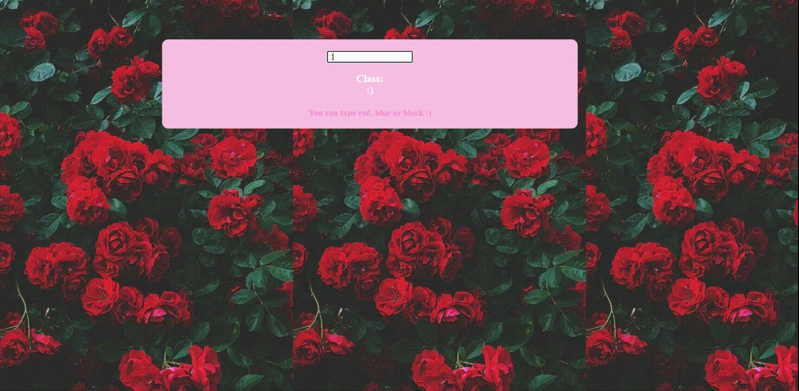
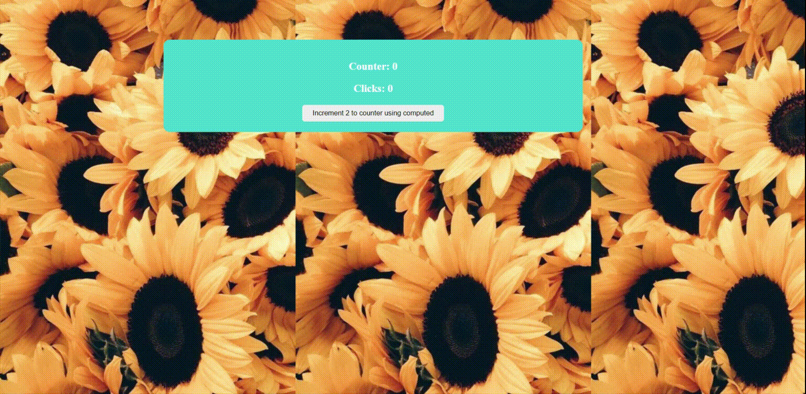
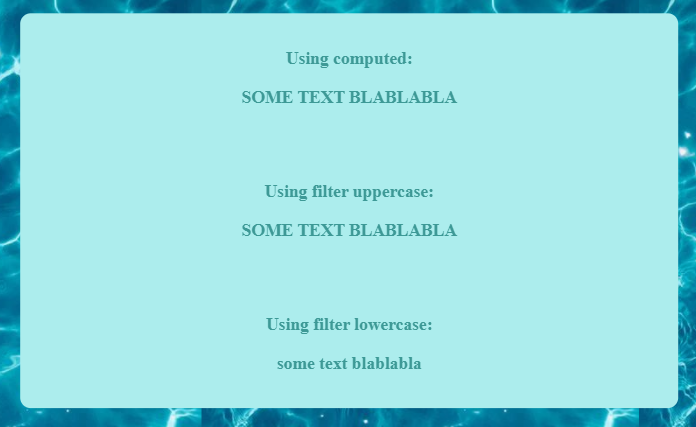
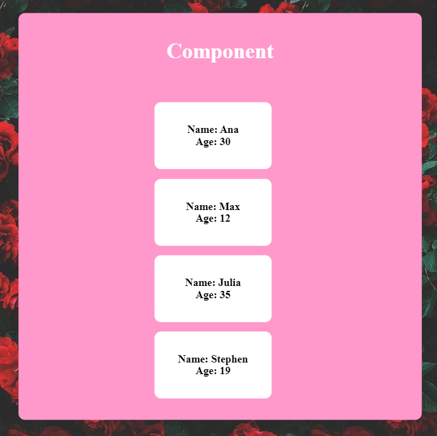

# little_store_vue_2020
It's a cute little store made with love and Vue haha

Also see:

    
Dinamic bind:

    
    <a href="https://codepen.io/wolfhaltz/pen/jOqZZKG">CodePen</a>
     
    <a href="some_studies/dinamic_bind.html">GitHub File</a>

  

    
Counter:

    
    <a href="https://codepen.io/wolfhaltz/pen/qBZxoXb">CodePen</a>
     
    <a href="some_studies/counter.html">GitHub File</a>

  

    
Conditional Show/Hide with boolean:

    
    <a href="https://codepen.io/wolfhaltz/pen/dyMdmqv">CodePen</a>
     
    <a href="some_studies/conditional_show_hide.html">GitHub File</a>

  

    
Change Text:

    
     
    <a href="https://codepen.io/wolfhaltz/pen/oNxEpMy">CodePen only with v-on:click</a>
     
    <a href="https://codepen.io/wolfhaltz/pen/ZEWrrOa">CodePen using a method on v-on:click</a>
     
    <a href="some_studies/change_text.html">GitHub File</a>

  

Filter

 
<a href="https://codepen.io/wolfhaltz/pen/MWyQGzb">CodePen</a>
 
<a href="some_studies/filter.html">GitHub File</a>

  

Component

 
<a href="https://codepen.io/wolfhaltz/pen/mdPXLZY">CodePen</a>
 
<a href="some_studies/component.html">GitHub File</a>

